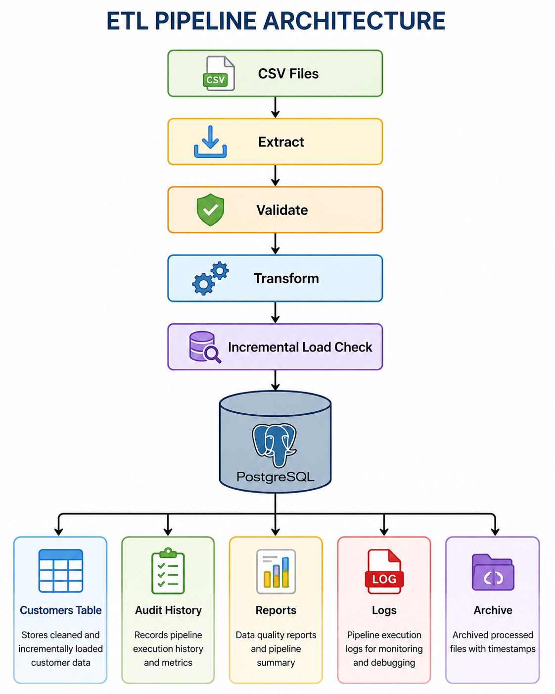
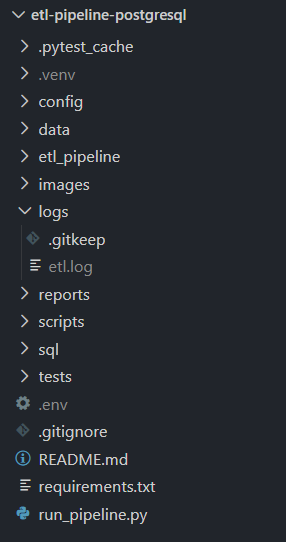
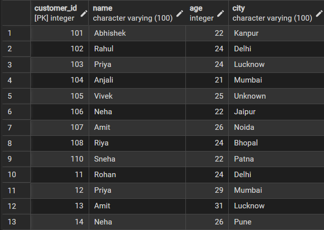
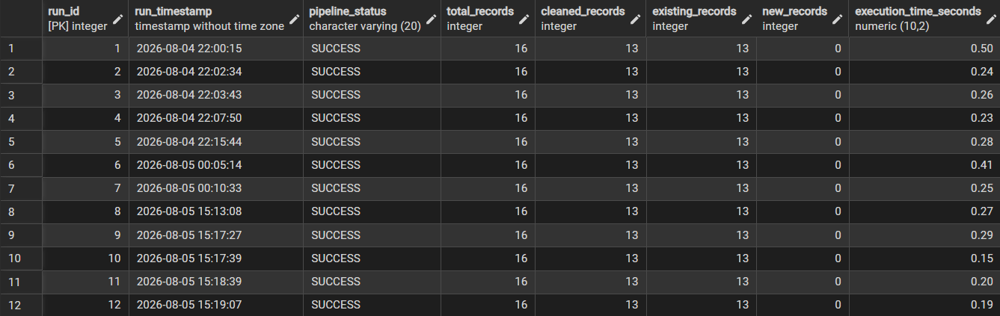
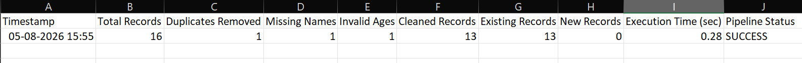
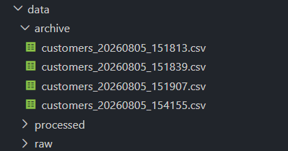
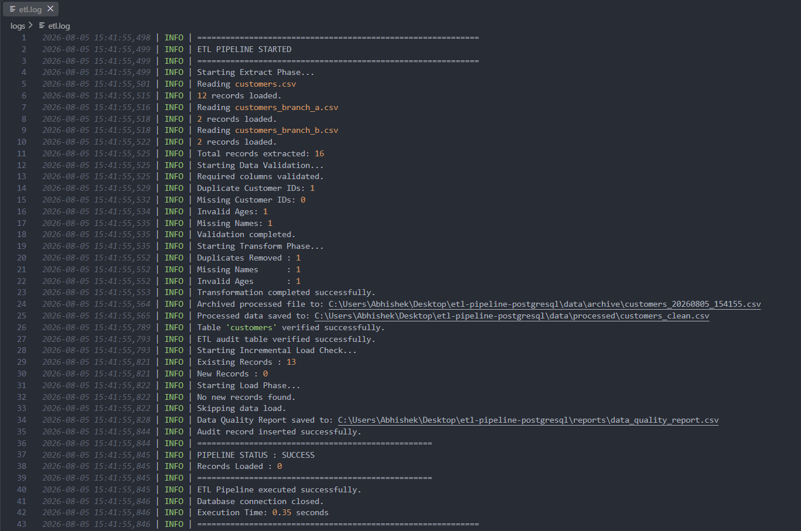
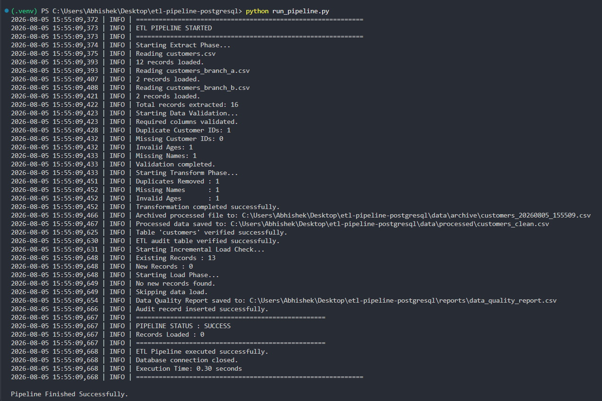

# 🚀 ETL Pipeline with PostgreSQL

<p align="center">


</p>

---

## 📌 Project Overview

This project is a **production-inspired ETL (Extract, Transform, Load) Pipeline** built with **Python** and **PostgreSQL**. It automates the process of extracting customer data from multiple CSV files, validating data quality, transforming raw records, performing incremental database loading, generating execution reports, maintaining audit history, archiving processed files, and logging every pipeline execution.

Unlike a basic ETL script, this project implements several production-ready engineering practices including:

- Multi-file CSV ingestion
- Data validation
- Data cleaning & transformation
- Incremental loading
- PostgreSQL integration
- Audit logging
- Data quality reporting
- File archiving
- Retry mechanism
- Notification system
- Command Line Interface (CLI)
- Unit testing with Pytest
- Configurable pipeline using YAML & environment variables
- Rotating log files

The project demonstrates how modern ETL pipelines are designed in real-world data engineering environments.

---

# ✨ Features

## 📥 Data Extraction

- Extracts data from multiple CSV files
- Automatically combines datasets into a single DataFrame
- Supports scalable raw data ingestion

---

## ✅ Data Validation

- Required column validation
- Duplicate Customer ID detection
- Missing Customer ID detection
- Missing Name detection
- Invalid Age detection
- Detailed validation logging

---

## 🔄 Data Transformation

- Removes duplicate records
- Cleans missing values
- Standardizes text fields
- Removes invalid records
- Produces clean processed dataset

---

## ⚡ Incremental Loading

Instead of inserting duplicate data every time the pipeline runs, the system:

- Checks existing customer IDs
- Identifies only new records
- Inserts only unseen records
- Improves loading performance
- Prevents duplicate database entries

---

## 🗄 PostgreSQL Integration

- Automatic table creation
- Customer data loading
- Audit history table
- Transaction management
- Safe database commits

---

## 📊 Data Quality Reporting

Automatically generates:

- Total records processed
- Duplicate records removed
- Missing names
- Invalid ages
- Existing records
- Newly loaded records
- Pipeline execution time
- Pipeline status

Reports are saved in CSV format.

---

## 📝 Audit Logging

Each execution stores:

- Timestamp
- Pipeline status
- Total records
- Cleaned records
- Existing records
- New records
- Execution time

This provides a complete execution history for monitoring.

---

## 📦 Automatic Archiving

Every processed dataset is archived with a timestamp.

Example:

```text
customers_20260805_151813.csv
customers_20260805_151907.csv
customers_20260805_154155.csv
```

This allows historical tracking and recovery of processed files.

---

## 📄 Logging

The pipeline generates professional logs containing:

- Extract status
- Validation results
- Transformation summary
- Database operations
- Incremental loading
- Errors
- Execution time

Rotating log files prevent unlimited log growth.

---

## 🔁 Retry Mechanism

Database connection failures automatically retry before terminating the pipeline.

This improves reliability during temporary database outages.

---

## 🔔 Notification System

The pipeline reports:

- Successful execution
- Failed execution

This module can easily be extended to send:

- Email notifications
- Slack alerts
- Microsoft Teams notifications

---

## 💻 Command Line Interface

Supports pipeline execution directly from the terminal using:

```bash
python -m etl_pipeline.cli run
```

Additional CLI commands can easily be added for future extensions.

---

## 🧪 Unit Testing

Implemented using **Pytest**.

Current test coverage includes:

- Extraction
- Validation
- Transformation
- Incremental Loading
- Database Loading

---

# 🏗 ETL Pipeline Architecture

<p align="center">

</p>

The pipeline follows the classic ETL workflow:

```text
CSV Files
      │
      ▼
Extract
      │
      ▼
Validate
      │
      ▼
Transform
      │
      ▼
Incremental Load
      │
      ▼
PostgreSQL
      ├── Customers Table
      ├── Audit History
      ├── Reports
      ├── Logs
      └── Archive
```

---

# 🛠 Technology Stack

| Category | Technologies |
|-----------|--------------|
| Programming Language | Python 3.13 |
| Database | PostgreSQL |
| Data Processing | Pandas |
| Database Driver | psycopg2 |
| Configuration | python-dotenv, YAML |
| Testing | Pytest |
| Logging | Python Logging + RotatingFileHandler |
| File Handling | pathlib, shutil |
| Reports | CSV |
| CLI | argparse |
| Version Control | Git & GitHub |

---

# 📌 Key Highlights

✔ Production-inspired ETL Architecture

✔ Modular Codebase

✔ PostgreSQL Integration

✔ Incremental Loading

✔ Data Validation

✔ Automated Reporting

✔ Audit History

✔ Rotating Logs

✔ File Archiving

✔ Retry Mechanism

✔ CLI Support

✔ Pytest Test Suite

✔ YAML Configuration

✔ Environment Variables

✔ Resume-Ready Data Engineering Project

---

# 📂 Project Structure

```text
etl-pipeline-postgresql/
│
├── config/
│   └── config.yaml
│
├── data/
│   ├── archive/
│   ├── processed/
│   └── raw/
│
├── etl_pipeline/
│   ├── archive.py
│   ├── audit.py
│   ├── cli.py
│   ├── config.py
│   ├── config_loader.py
│   ├── extract.py
│   ├── incremental.py
│   ├── load.py
│   ├── logger.py
│   ├── notification.py
│   ├── pipeline.py
│   ├── report.py
│   ├── retry.py
│   ├── settings.py
│   ├── transform.py
│   └── validation.py
│
├── images/
│   ├── architecture.png
│   ├── archive_folder.png
│   ├── customers_table.png
│   ├── data_quality_report.png
│   ├── etl_run_history.png
│   ├── folder_structure.png
│   ├── logs.png
│   └── pipeline_execution.png
│
├── logs/
│
├── reports/
│
├── scripts/
│   └── check_db_connection.py
│
├── sql/
│   ├── create_customers_table.sql
│   └── create_etl_run_history.sql
│
├── tests/
│   ├── test_extract.py
│   ├── test_extract_multiple.py
│   ├── test_incremental.py
│   ├── test_load.py
│   ├── test_transform.py
│   └── test_validation.py
│
├── .env
├── .gitignore
├── README.md
├── requirements.txt
└── run_pipeline.py
```

---

## 📁 Folder Structure

<p align="center">

</p>

The project follows a modular architecture where every ETL phase has its own dedicated Python module, making the codebase clean, scalable, and easy to maintain.

---

# ⚙️ Installation

## 1️⃣ Clone the Repository

```bash
git clone https://github.com/your-username/etl-pipeline-postgresql.git

cd etl-pipeline-postgresql
```

---

## 2️⃣ Create a Virtual Environment

### Windows

```bash
python -m venv .venv
```

Activate:

```bash
.venv\Scripts\activate
```

---

### Linux / macOS

```bash
python3 -m venv .venv

source .venv/bin/activate
```

---

## 3️⃣ Install Dependencies

```bash
pip install -r requirements.txt
```

---

# 📦 Required Python Packages

Major packages used in this project:

- pandas
- psycopg2
- python-dotenv
- PyYAML
- pytest

Install manually if needed:

```bash
pip install pandas psycopg2 python-dotenv pyyaml pytest
```

---

# 🗄 PostgreSQL Setup

Create a PostgreSQL database.

Example:

```sql
CREATE DATABASE etl_pipeline;
```

No tables need to be created manually.

The pipeline automatically creates:

- customers
- etl_run_history

during execution.

---

# 🔐 Environment Variables

Create a **.env** file in the project root.

Example:

```env
DB_HOST=localhost
DB_PORT=5432
DB_NAME=etl_pipeline
DB_USER=postgres
DB_PASSWORD=your_password
```

Using environment variables keeps sensitive credentials out of the source code.

---

# ⚙ Configuration File

The project also supports YAML configuration.

Example:

```yaml
logging:
  level: INFO

database:
  table_name: customers

pipeline:
  retry_attempts: 3
```

Configuration values can easily be modified without changing the source code.

---

# 📥 Input Data

Place raw CSV files inside:

```text
data/raw/
```

Example:

```text
customers.csv
customers_branch_a.csv
customers_branch_b.csv
```

The Extract module automatically loads every CSV file found inside the folder.

No code changes are required when adding new files.

---

# 📤 Output Files

After execution, the pipeline automatically generates:

```text
data/
├── processed/
│   └── customers_clean.csv
│
├── archive/
│   ├── customers_20260805_151813.csv
│   ├── customers_20260805_151907.csv
│   └── ...
```

Additional outputs include:

```text
reports/
└── data_quality_report.csv

logs/
└── etl.log
```

---

# 🚀 Running the Pipeline

Run the ETL pipeline using:

```bash
python run_pipeline.py
```

or

```bash
python -m etl_pipeline.pipeline
```

The pipeline automatically performs:

1. Extract
2. Validate
3. Transform
4. Save Clean Dataset
5. Archive Processed File
6. Incremental Load Check
7. PostgreSQL Load
8. Generate Report
9. Insert Audit Record
10. Log Execution
11. Send Notification

---

# 💻 Command Line Interface (CLI)

The project also provides a Command Line Interface.

Run the complete ETL process:

```bash
python -m etl_pipeline.cli run
```

Show help:

```bash
python -m etl_pipeline.cli --help
```

The CLI architecture makes it easy to add future commands such as:

```bash
python -m etl_pipeline.cli validate

python -m etl_pipeline.cli report

python -m etl_pipeline.cli archive

python -m etl_pipeline.cli retry
```

---

# 🔄 Pipeline Execution Flow

```text
Read CSV Files
      │
      ▼
Validate Records
      │
      ▼
Clean Data
      │
      ▼
Save Processed CSV
      │
      ▼
Archive Processed File
      │
      ▼
Check Existing Database Records
      │
      ▼
Insert Only New Records
      │
      ▼
Generate Report
      │
      ▼
Store Audit History
      │
      ▼
Write Logs
      │
      ▼
Notify Success / Failure
```

---

# 📊 PostgreSQL Database

The ETL pipeline automatically creates and manages the required PostgreSQL tables.

---

# 👥 Customers Table

The **customers** table stores the cleaned customer records after validation, transformation, and incremental loading.

<p align="center">

</p>

### Table Columns

| Column | Type | Description |
|---------|------|-------------|
| customer_id | INTEGER | Primary Key |
| name | VARCHAR(100) | Customer Name |
| age | INTEGER | Customer Age |
| city | VARCHAR(100) | Customer City |

---

# 📜 ETL Run History

Every pipeline execution is automatically recorded in the **etl_run_history** table.

This enables complete pipeline monitoring and auditing.

<p align="center">

</p>

### Audit Columns

| Column | Description |
|---------|-------------|
| run_id | Unique execution ID |
| run_timestamp | Execution timestamp |
| pipeline_status | SUCCESS / FAILED |
| total_records | Records extracted |
| cleaned_records | Records after cleaning |
| existing_records | Existing database records |
| new_records | Newly inserted records |
| execution_time_seconds | Total execution time |

---

# 📈 Data Quality Report

Every pipeline execution generates a detailed CSV report summarizing the ETL process.

Location:

```text
reports/data_quality_report.csv
```

<p align="center">

</p>

### Report Metrics

- Total Records
- Duplicates Removed
- Missing Names
- Invalid Ages
- Cleaned Records
- Existing Records
- New Records
- Execution Time
- Pipeline Status

This report provides a quick overview of each ETL execution and can be shared with stakeholders or used for monitoring.

---

# 📂 Archive Folder

Each processed dataset is automatically archived using a timestamped filename.

<p align="center">

</p>

Example:

```text
customers_20260805_151813.csv
customers_20260805_151839.csv
customers_20260805_151907.csv
customers_20260805_154155.csv
```

### Benefits

- Historical backups
- Easy rollback
- Data versioning
- Execution tracking

---

# 📝 Logging

Every ETL execution is logged in detail.

Location:

```text
logs/etl.log
```

<p align="center">

</p>

The log file records:

- Pipeline start/end
- Extraction details
- Validation summary
- Transformation metrics
- Database operations
- Incremental loading
- Report generation
- Audit insertion
- Errors & exceptions
- Execution time

Rotating log files prevent unlimited file growth.

---

# ▶ Pipeline Execution

Example console output after running the ETL pipeline.

<p align="center">

</p>

Typical execution steps include:

```text
✔ Extract CSV Files
✔ Validate Data
✔ Transform Records
✔ Save Processed Dataset
✔ Archive Processed File
✔ Verify Database Tables
✔ Incremental Load Check
✔ Load New Records
✔ Generate Report
✔ Insert Audit Record
✔ Notify Pipeline Status
✔ Finish Execution
```

---

# 🧪 Unit Testing

The project includes automated unit tests using **Pytest**.

Current test modules:

```text
tests/
│
├── test_extract.py
├── test_extract_multiple.py
├── test_validation.py
├── test_transform.py
├── test_incremental.py
└── test_load.py
```

Run all tests:

```bash
pytest
```

Run with verbose output:

```bash
pytest -v
```

Example:

```text
==========================
12 tests collected

✔ test_extract
✔ test_validation
✔ test_transform
✔ test_incremental
✔ test_load

==========================
All tests passed
```

---

# 📦 Generated Outputs

After a successful pipeline execution, the project automatically generates:

```text
data/
├── processed/
│   └── customers_clean.csv
│
├── archive/
│   ├── customers_20260805_151813.csv
│   ├── customers_20260805_151839.csv
│   └── ...
│
reports/
│   └── data_quality_report.csv
│
logs/
│   └── etl.log
```

Additionally, PostgreSQL stores:

- Customers Table
- ETL Run History

---

# 🔒 Reliability Features

The pipeline includes several production-oriented capabilities:

- ✅ Automatic table creation
- ✅ Incremental loading
- ✅ Duplicate prevention
- ✅ Audit logging
- ✅ Data quality reporting
- ✅ Timestamped file archiving
- ✅ Rotating log files
- ✅ Retry mechanism for database connections
- ✅ CLI support
- ✅ YAML configuration
- ✅ Environment variable support
- ✅ Unit testing with Pytest

---

# 🔄 End-to-End ETL Workflow

The following illustrates the complete lifecycle of the ETL pipeline.

```text
                Raw CSV Files
                      │
                      ▼
              Extract Multiple Files
                      │
                      ▼
              Validate Raw Data
      (Missing Values, Duplicates, Invalid Ages)
                      │
                      ▼
             Transform & Clean Data
                      │
                      ▼
         Save Processed Customer Dataset
                      │
                      ▼
         Archive Processed CSV File
                      │
                      ▼
          Connect to PostgreSQL Database
                      │
                      ▼
       Create Tables (if not already exist)
                      │
                      ▼
        Perform Incremental Load Check
                      │
                      ▼
          Insert Only New Customer Records
                      │
                      ▼
        Generate Data Quality Report (CSV)
                      │
                      ▼
      Store Execution Metrics in Audit Table
                      │
                      ▼
         Write Detailed Execution Logs
                      │
                      ▼
         Send Success / Failure Notification
                      │
                      ▼
             Pipeline Execution Complete
```

---

# 🚀 Production Features

This project incorporates several real-world data engineering practices.

| Feature | Status |
|----------|:------:|
| Multi-file CSV Extraction | ✅ |
| Data Validation | ✅ |
| Data Cleaning | ✅ |
| Incremental Loading | ✅ |
| PostgreSQL Integration | ✅ |
| Automatic Table Creation | ✅ |
| Audit Logging | ✅ |
| Data Quality Report | ✅ |
| File Archiving | ✅ |
| Rotating Logs | ✅ |
| Retry Mechanism | ✅ |
| CLI Support | ✅ |
| YAML Configuration | ✅ |
| Environment Variables | ✅ |
| Unit Testing | ✅ |
| Modular Architecture | ✅ |

---

# 💼 Resume Highlights

This project demonstrates experience with:

- Building an end-to-end ETL pipeline using Python and PostgreSQL.
- Designing a modular and scalable ETL architecture.
- Extracting and combining data from multiple CSV sources.
- Implementing data validation and transformation workflows.
- Performing incremental database loading to prevent duplicates.
- Creating automated data quality reports and audit history.
- Implementing logging, retry mechanisms, and file archiving.
- Developing command-line tools (CLI) for pipeline execution.
- Writing automated unit tests using Pytest.
- Managing configuration through YAML files and environment variables.

---

# 📈 Skills Demonstrated

### Data Engineering

- ETL Development
- Data Validation
- Data Cleaning
- Data Transformation
- Incremental Loading
- Data Quality Monitoring

### Python

- Pandas
- pathlib
- argparse
- logging
- shutil
- datetime
- dotenv
- YAML
- Exception Handling

### Database

- PostgreSQL
- SQL
- Primary Keys
- Transactions
- DDL
- DML

### Software Engineering

- Modular Design
- Unit Testing
- Configuration Management
- Logging
- Error Handling
- Retry Strategy
- Git & GitHub

---

# 📚 Future Improvements

Potential enhancements include:

- Apache Airflow integration for workflow orchestration.
- Docker containerization.
- REST API for triggering ETL jobs.
- Email and Slack notifications.
- Cloud deployment (AWS, Azure, or GCP).
- Scheduling with cron jobs or Airflow.
- Dashboard for monitoring pipeline runs.
- Support for Excel, JSON, and Parquet files.
- Data versioning and rollback support.
- Integration with cloud data warehouses such as Snowflake or BigQuery.

---

# 🤝 Contributing

Contributions are welcome!

If you'd like to improve this project:

1. Fork the repository.
2. Create a feature branch.

```bash
git checkout -b feature/new-feature
```

3. Commit your changes.

```bash
git commit -m "Add new feature"
```

4. Push to your branch.

```bash
git push origin feature/new-feature
```

5. Open a Pull Request.

---

# ⭐ If You Like This Project

If you found this repository helpful, consider giving it a ⭐ on GitHub.

It helps others discover the project and motivates further improvements.

---

# 📄 License

This project is licensed under the MIT License.

You are free to use, modify, and distribute this project for educational and personal purposes.

---

# 👨‍💻 Author

**Abhishek**

B.Tech Computer Science Engineering

Data Analytics • Data Engineering • Software Development

GitHub: **https://github.com/Abhishek-Savita-3012**

LinkedIn: **https://linkedin.com/in/abhishek-savita-b41961276**

---

<p align="center">

### ⭐ Thank you for visiting this repository! ⭐

If you found this project useful, don't forget to leave a star.

**Happy Coding! 🚀**

</p>